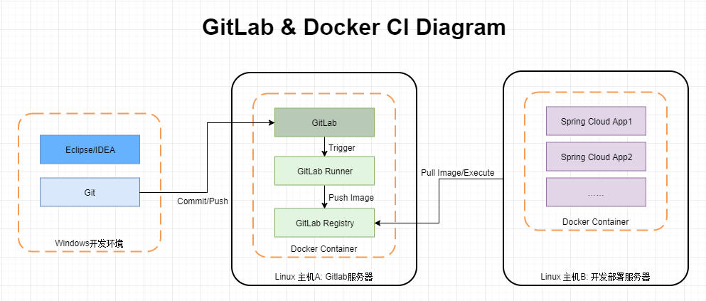

# Spring Cloud GitLab Docker CI搭建
Spring Cloud template projects and CI with GitLab and Docker 
[Spring Cloud GitLab Docker CI搭建.pdf](Spring%20Cloud%20GitLab%20Docker%20CI搭建.pdf)

##	目标
搭建Spring Cloud + GitLab + Docker的持续集成开发环境。

## 内容
*	Spring Cloud Hello World工程: 含Eureka，Feign/Hystrix，Zuul 
*	GitLab及持续集成配置
*	Docker及本地Docker仓库

## 预备环境
CentOS7 Linux主机两台：
主机A: GitLab及GitLab Runner环境，本文档中IP为192.168.1.211
主机B：Spring Cloud工程开发运行环境, 本文档中IP为192.168.1.212

##	预备知识
1. 掌握基本Spring Boot开发
2. 掌握Linux，Git，Maven基础操作
3. 了解Docker基本概念和命令 
https://docs.docker.com/get-started/ 
4. 了解持续集成基础知识
5. 了解Spring Cloud各基本组件：Eureka Server/Client，Feign，Zuul   
中文参考文档：https://springcloud.cc/  
英文参考文档：http://cloud.spring.io/spring-cloud-static/Finchley.RELEASE/multi/multi_spring-cloud.html 

## 架构图

